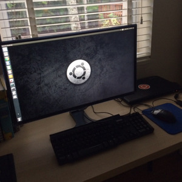

These are the tools I'm currently using for web development:

- **Computer**: Toshiba Satellite C55. 4Gb of RAM. Intel Celeron N2830 dual core processor.  It's a little underpowered, but it was cheap (~$250) and does the trick for now. 
- **Operating System**: Ubuntu 16.04 LTS
- **Static Site Generator**: [Metalsmith](https://metalsmith.io), a simple, pluggable static site generator made with JavaScript.
- **Responsive Framework**: Custom CSS: [minimal.css](/css/minimal.css).
- **Version Control**: [Github](https://github.com/mariobox).
- **Text Editor**: [Visual Studio Code](https://code.visualstudio.com/).
- **Hosting**: Nginx virtual private server running on an Ubuntu 16.04 droplet at [Digital Ocean](https://m.do.co/c/b96aa4f9fdfd) (referral link).
- **SSL/TLS** Certificate by [Let's Encrypt](https://letsencrypt.org), to serve this site through HTTPS.

-------

The basic workflow I follow to update this site goes like this:

1. Write posts or page content in [Markdown](https://daringfireball.net/projects/markdown/).
2. Go to the root folder of my project: `/` and run Metalsmith: `npm start`. This converts the markdown files to HTML and saves the updated site in the `/public` folder.
3. Git commit the changes by running the following from the `/` root folder: `git add --all` and `git commit -m "made some changes"`.
4. Push the files to Github's remote repository: `git push origin master`.
5. Push the static files in the `/public` folder to my Digital Ocean VPS by running `./deploy.sh` from the root folder. `deploy.sh` is a custom bash script that syncs the public folder in my local computer with the public folder in my VPS.
6. Open the browser, navigate to the site and check that everything looks OK. If something is off, fix it and go back to #2.
