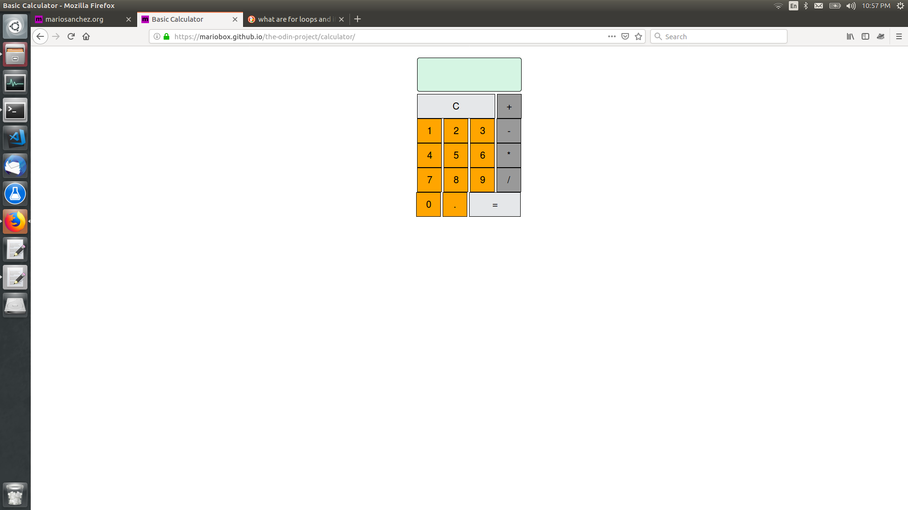

**Made with**: <i class="icon-javascript-alt"></i> JavaScript | <i class="icon-jquery"></i> jQuery

**Project Summary**:

Basic calculator to add, subtract, multiply and divide.

[Source Files](https://github.com/mariobox/the-odin-project/tree/master/calculator) | [Live Demo](http://mariobox.github.io/the-odin-project/calculator/)

Project involved creating the calculator interface with HTML and CSS and then adding fuctionality through event handlers and callback functions.

