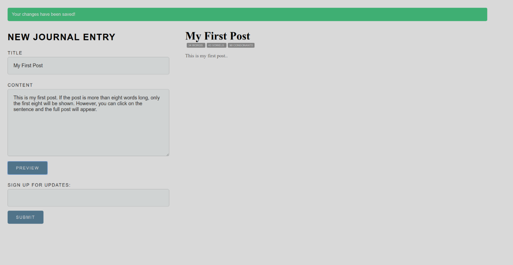

**Made with**: <i class="icon-gulp"></i> Gulp and <i class="icon-jquery"></i> jQuery

**Project Summary**:

Front end simulation of a journal required as practice project at Epicodus code school. Incorporates a word, vowel and consonant counter.

[Source Files](https://github.com/mariobox/gulp-journal) | [Live Demo](https://mariobox.github.io/gulp-journal/)

## Specs

* Create a journaling website where a user can write entries including at least a title and body.
* Create Entry objects that include a method to return the number of words in the entry.
* Add a separate method (or methods) to return the number of vowels and consonants in each entry.
* Call each of these methods from your front-end file to display their return values.
* Finally, add a method to return the first sentence of the entry (if the sentence is over 8 words, only display a teaser sentence made of the first 8 words).
* Call all methods from your front-end file to display the results as well, whenever a new journal entry is created.

Aside from that, I added the following to make the project better:

* Add a &#8220;subscribe to update" form and display a confirmation message once the user submits their information (I did this to have two input forms, one for the journal entry and one for the subscription, each with its own javascript interface, so that I can demonstrate Gulp's concat task).
* Add a feature to display the full post when the user clicks on the teaser sentence.
* Add a top banner that disappears after a few seconds, telling users that their changes have been sent.

## Objective

* To demonstrate different tasks you can accomplish with Gulp:
    * Concatenate
    * Minify
    * Clean
    * Build

* To understand the difference between the **development environment** and the **production environment**.

* To understand the advantages of using Gulp in large sites, by working on a smaller-scale, simpler application.

## Related

Here is another project using Gulp, jQuery and Object Oriented Javascript: 

It is a simple exercise where you provide a number, and the program prints all numbers from one to the number you chose, replacing the multiples of three with &#8220;ping", the multiples of five with &#8220;pong" and the multiples of fifteen with &#8220;ping-pong". [Source Code](https://github.com/mariobox/ping-pong) | [Live Demo](https://mariobox.github.io/ping-pong)

