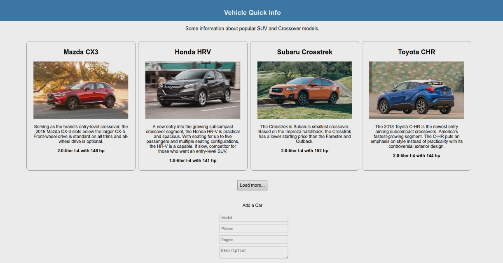

**Made with**: <i class="icon-reactjs"></i> ReactJS

**Project Summary**:

Gallery of tiles displaying information about different cars. Includes button to load more cars, and a form to add new cars to the gallery.

[Source Files](https://github.com/mariobox/react-car-app) | [Live Demo](http://mariobox.github.io/react-car-app-demo)

At its initial state, the app displays four cards for four different cars. If you click on the "Load More" button, it will display four more cards. There is also a brief form where users can add new cars to the gallery.

The main topics and techniques that I learned or practiced through this project are:

* How to use the <code>create-react-app</code>. This app simplifies your ReactJS development process by providing all the scaffolding necessary to start coding right away. It even gives you the option to fire up a development server that refreshes automatically every time you make and save a change.
* Practice ES6 concepts like classes, arrow functions and modules.
* Learn about JSX, a preprocessor step that adds XML syntax to JavaScript. JSX works basically like HTML but lets you create your own elements.
* Understand the concept of state. You can think of state as a single JavaScript object which represents all the data in your app at any given time.
* How to work with props (properties) and <code>this</code>.
* How to work with components and the import and export syntax in order to link different ReactJS files to make them work together.
* Understand the difference between the development and the production environments.

You van view the [Source Files](https://github.com/mariobox/react-car-app) or a [Live Demo](http://mariobox.github.io/react-car-app-demo).

**Note**: For this project I followed this [ReactJS tutorial](https://code.tutsplus.com/series/react-crash-course-for-beginners--cms-1204) as a guide. It has a more detailed explanation of each step if you want to take a look or try it out yourself.
