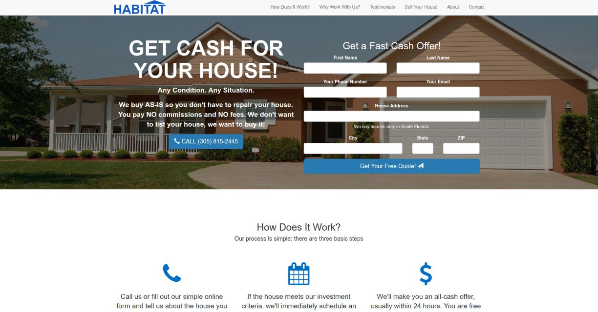

**Made with**: <i class="icon-bootstrap"></i> Bootstrap, <i class="icon-jquery"></i> jQuery

**Project Summary**:

Responsive company website for a real estate investments business.

[Source Files](https://github.com/rlo555/rlo555.github.io) | [Live Demo](http://habitatinvestors.com)

The objective was to design a clean, efficient, and fully responsive website for a real estate investments business. It needed to clearly describe what the company did, and include easy to follow call-to-actions throughout the site.

It was made using the [Agency](https://startbootstrap.com/template-overviews/agency/) template for Bootstrap, a fully functional form by [Formspree](http://formspree.io), and several jQuery plugins for smooth transitions and a carrousel of testimonials.
