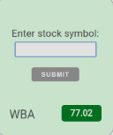

**Made with**: <i class="icon-nodejs"></i> NodeJS and <i class="icon-jquery"></i> jQuery

**Project Summary**: 

Simple stock price finder.

[Source Files](https://github.com/mariobox/stock-quotes) | [Live Demo](https://mariobox.github.io/stock-quotes/)

This is a minimalistic app that gives you the latest closing price of any company stock in the NYSE. 

Type a stock symbol in the input field, click submit, and the app will make an AJAX call to the [Quandl](https://www.quandl.com/) API and display the stock price at the latest market closing. If the stock closing price is equal or higher than its opening price, the price will be displayed in a green background. If not, the background will be red.

Since AJAX calls to Quandl are subject to the same origin policy, it may be necessary to download the [Allow-Control-Allow-Origin Chrome plug-in](https://chrome.google.com/webstore/detail/allow-control-allow-origi/nlfbmbojpeacfghkpbjhddihlkkiljbi?hl=en) in order to make this app work in your browser.

