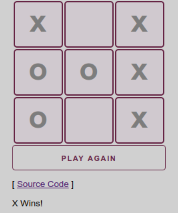

This project has been refactored using Object Oriented Javascript. View the [source code](https://mariobox.github.io/tic-tac-toe-oojs).

**Made with**: <i class="icon-javascript-alt"></i> JavaScript

**Project Summary**:

Use pure JavaScript to code the popular Tic-Tac-Toe game

[Source Files](https://github.com/mariobox/tic-tac-toe) | [Live Demo](https://mariobox.github.io/tic-tac-toe/)

These are roughly the steps I took. If you prefer to look at the [source code](https://github.com/mariobox/tic-tac-toe) directly, there are plenty of comments that explain the code so it can be followed more easily.

We start by defining the variables we're going to need. We have a few arrays, to store each player's choices, and some counters that will help us keep track of each player's turns. We also defined an array call "winners" that holds all the possible winning cell combinations using the cell's id. This step also creates a button that refreshes the page on click, so that players can play again once a game has ended.

We then write the code to build and display the grid on the page, which is done on page load. We use the <code>createElement()</code> method to create the table with its rows and columns, and the  <code>appendChild()</code> method to display the different elements on the page in the right order. The table is then placed in a main <code>div</code> with the id of &#8220;board". At this stage, we also give each cell a unique id (from 1 to 9 for a 9-cell grid).

We then create the code to enable players to start playing. For this, we define an event listener so that when player X clicks on a cell, an &#8220;X" is displayed ( or an &#8220;O" if it's player O's turn). We also incorporate a counter so that the event listener knows when to display an &#8220;X" or an &#8220;O" depending on who's player's turn it is. If any given player has selected three or more cells, the program automatically runs a function to check if the player has won.

The function that checks if the player has won basically compares the player's choices (which are being stored in an array) to the winning combinations stored in the &#8220;winners" array we defined at the beginning. If there is a match, the game ends and a message indicating which player has won is logged to the screen. In case the nine cells are filled and there is no winner, a message saying &#8220;Nobody Won. Play Again." is logged to the screen.

How can this be improved? Perhaps we could have a counter for the number of times each player has won, and display it on the screen. I'll work on that some other time.

