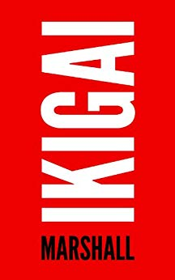

[Sebastian Marshall](http://sebastianmarshall.com) is a self-taught young strategist who draws heavily from history and the careful study of business books. In Ikigai, he offers insightful advice on personal and business philosophy and strategy.

The book was put together in a week (mostly from blog content) as a dare to an old-school publisher who had offered to publish it but had been dragging the project for months. As a result, some passages may sound repetitive and there are several grammatical and spelling errors, but don't get fooled: there is gold on those pages if you just can see beyond the rough surface.

### Book Highlights

&#8220;Walk the center path with other people's objectives.&quot;

&#8220;I want everyone who connects with me to be better off.&quot;

&#8220;90% of the people I draw up plans for, plans that would clearly work, don't act on them. It's like everyone fantasizes about 'whatever' but once their fantasies start to become reality, they piss their pants and self-sabotage.&quot;

&#8220;High quality paper is a super hack to come across as ultra-professional.&quot;

&#8220;Do a bunch of stuff that might work, and won't hurt too bad if it doesn't work.&quot;

&#8220;Identify what makes people succeed at a massively high level. Do that. If that's not working, go back to step and try again.&quot;

&#8220;Listen to audiobooks and learning while doing other things.&quot;

&#8220;I must be neutral, study even successful people I don't like. My mind should not become an echo chamber.&quot;

&#8220;Greatness is not something you are, it's something you do.&quot;

&#8220;Serve, build, inspire, connect, defend, protect, establish, write, experiment, teach, help.&quot;

&#8220;Start building skills, resources, experiences, and mobility.&quot;

&#8220;Read the sequences on LessWrong, click sequences, read almost all of them. These will teach you how to think better.&quot;

&#8220;Go to Wikipedia once a week, and put in a historical leader or era of history, and start reading.&quot;

&#8220;You don't know what's possible unless you study history.&quot;

&#8220;If you're taking general university courses, take accounting. It's really useful, but it's too boring to self-study.&quot;

&#8220;Start learning general social skills. I recommend you read How to Win Friends and Influence People, but don't read it cover to cover. Instead, read one chapter per week, and then practice the ideas from it.&quot;

&#8220;Learn how to negotiate. Read books on negotiation. I think Critical Conversations is probably the best one to start with.&quot;

&#8220;Never, ever, ever get into debt. Just don't do it. If you have debt (student loans, credit cars, etc), pay them off as soon as you have any cash at all.&quot;

&#8220;Debt cripples a man's ability to do what he wants with his life. Stay away from it at all costs.&quot;

&#8220;Train yourself to do arithmetic fast. There's more value in being able to add, subtract, divide, and do percents fast than in any other kind of math.&quot;

&#8220;Start filling up your dead time. Bring a book or audio with you when you're running errands, commuting, things like that. Life is precious, either explicitly relax, or do something valuable.&quot;

&#8220;This one is big, start listening to audio if you don't.&quot;

&#8220;Start building skills, credentials, money, contacts.&quot;

&#8220;So, what are your larger roles? It's not easy to pick. It's not like a minute exercise. It's something you go to a cafe with a notebook and pen and sit there staring at the page with a coffee, thinking for an hour. Even one hour isn't enough. You do the think-with-coffee thing dozens of times, hundreds of times if you need to, trying to discover what matters to you, what you can dedicate yourself to, what's important, what works.

&#8220;There's many ways to live a good and meaningful life, but I think one of the most important steps is to think on what a good and meaningful life would be to you.&quot;

&#8220;If/when you do know what matters most to you, then the rest of the points are just cost/benefit, expected value, planning, forecasting, things like that.&quot;

&#8220;In a world where marketing and advertising exists, you need to do it because that's the equilibrium. If you fight against equilibriums, you lose.&quot;

&#8220;High happinesses: triumph, camaraderie, epiphany, wisdom. Those I think are worth pursuing.&quot;

&#8220;Depending on how much you've traveled and studied different eras of history, you probably have lots of views about &quot;the way things are&quot; that isn't actually the way things are. Just your culture at this particular moment in history.&quot;

&#8220;While you're learning, start building. Eventually you're going to find causes that matter to you.&quot;

&#8220;I chase meaning, the happiness and fun largely takes care of itself.&quot;

&#8220;Distribution and marketing are of core importance to business.&quot;

&#8220;When someone eats, sleeps, breathes, walks, works, lives with one purpose, he will usually achieve that purpose.&quot;

&#8220;Be grateful to the scientists and engineers and inventors and builders and artists that came before us.&quot;

&#8220;By doing an action repeatedly, eventually you become the kind of person who does that action. If you repeatedly ask, &quot;What can I do to come across as helpful?&quot; and execute on that, then you become a helpful person.

&#8220;Spread the good around, it'll catch up with you sooner or later.&quot;

&#8220;It's virtuous and appropriate to build wealth and become powerful. Expect to be treated well. Be friendly, giving, and helpful and don't expect anything in return. Yet, when you've got something of value, offer good deals and get compensated. Don't define yourself by money and possessions. There's an unlimited amount of wealth and power available, you can gain it by building, inventing, innovating, cooperating, trading, and doing other virtuous things. Don't be stingy and scramble for the last penny, leave something on the table. But don't be too shy either, build and receive a lot in return.&quot;

&#8220;Don't define yourself by money and possessions. There's an unlimited amount of wealth and power available, you can gain it by building, inventing, innovating, cooperating, trading, and doing other virtuous things.&quot;

&#8220;Expect to be treated well, and act accordingly. Have a calm expectancy that people will agree to do things your way. Don't argue or get upset, but do calmly insist that things be done correctly.&quot;

&#8220;Sell some things you produce, sell some of your skills, get paid. It's cool to ask people for money as long as you know you can deliver x the value of what you're being paid.&quot;

&#8220;The victors: the ones who build the really enduring victories, they're often not the most brilliant or charismatic or brave. They're the ones who are most patient, who are most rational, who have the most self-control.&quot;

&#8220;There are seven emotions: joy, anger, anxiety, love, grief, fear, and hate, and if a man does not give way to these he can be called patient.&quot;

&#8220;I'm scared sometimes of giving way to being joyful. It is a good thing to feel joyful, but not to let joy dull your edge.&quot;

&#8220;Of the common virtues, the successful seem to have an immense amount of loyalty and reverence for the people that &quot;got them there,&quot; revering and celebrating them even as they bring more and more people to their banner. The people who break from their early friends and supporters usually end poorly, in an isolation of their own making.&quot;

&#8220;The people who break from their early friends and supporters usually end poorly.&quot;

&#8220;By taking great care of the people who elevated you from the beginning, you build a stronger foundation that's worthy of respect.&quot;

&#8220;Two kinds of ways trade and interact and cooperate. The first way would be through &quot;market norms&quot;, this is where two people clearly agree to make an exchange, and deliver what they agreed to exchange, and the deal is concluded. The second way is through &quot;social norms&quot;, where you're looking out for each other's best interests.&quot;

&#8220;Derek Sivers wrote a review of Predictably Irrational (http://sivers.org/book/PredictablyIrrational) that I highly recommend.&quot;

&#8220;Market norms push out social norms. But I've started to wonder if this can be avoided by always leaving something on the table. This means getting away from haggling, grinding up/down to the absolute final price someone would pay, and hard selling. For my work, I'm going to be aiming to generate a x return on investment over the the next three years. Yes, that's %. I think that's the first part, looking out for their interests and not grinding.&quot;

&#8220;Good negotiation is about figuring out what you can offer that's worth more to the other person than you, and what they can offer that's worth more to you than them.&quot;

&#8220;If you're selling, the deal or product you offer should seem like a fantastically good value, like your service existing is a favor to the person doing business with you.&quot;

&#8220;If you want to stay away from exchange-based feelings, be very enjoyable to work with. Figure out what your client or provider's highest-level goals are, and help them get it. Pay well if you're buying, over-deliver to a ridiculous extent so it's clear you're above and beyond the call if you're selling. And make it enjoyable, really enjoyable, so it doesn't seem like work.&quot;

&#8220;You need to make everyone look good.&quot;

&#8220;Make people look good to the people they really care about.&quot;

&#8220;Looking out for people outside of the scope of the deal can help make it about more than just the deal.

&#8220;I never liked spending money on comfort or luxury that doesn't serve a higher purpose. I eat very simply, I sleep simply, I don't need or want much.&quot;

&#8220;I'm not trying to sacrifice and suffer and martyr myself when I help people. I ask for feedback.&quot;

&#8220;Make connecting with people part of my entertainment time. You know, when most people are watching TV, I'm reading email, writing email, hopping on the phone with people, answering questions, helping other people do strategy.&quot;

&#8220;I added a note to my daily checklist for a while, &quot;Reach out to someone&quot;.

&#8220;Make connecting with people part of your entertainment time.&quot;

&#8220;Start by sending out short (the shorter the better) emails to people who you see saying or doing something cool. Even if they don't write back, I guarantee they appreciate it.&quot;

&#8220;Embarrassment and errors are part of doing meaningful things. It's not such a big deal, really.&quot;

&#8220;Embarrassment? Dude, eternity stretches before and after us. Embarrassment is your neurochemistry in a mildly uncomfortable position. It doesn't matter at all.&quot;

&#8220;Good Marketing Is Mostly Just Having People Want to Spend Time With You.&quot;

&#8220;When someone spends their time with me, whatever the medium, that's a tremendous honor.&quot;

&#8220;Good marketing goes, &quot;This person could be anywhere else, let's make it worth their while.&quot;&quot;

&#8220;The rest of good marketing is offering people something worth many, many times more than what you're charging.&quot;

&#8220;Tell people what you're doing and let them decide if it's right for them.&quot;

&#8220;The first step to being a great marketer is respecting your own time.&quot;

&#8220;The quintessential, alpha-omega principle of strategy, which is - Do things for reasons.&quot;

&#8220;Do not simply &quot;do shit&quot; for no reason.&quot;

&#8220;The way to start doing that is to ask, &quot;What is my objective here?&quot; Then, &quot;What course of action makes me most likely to reach that objective?&quot;

&#8220;Ask, &quot;What is my objective here? What gives me the best chance of reaching it?&quot;

&#8220;Maybe the biggest problem really intelligent people have is that they spend more time being clever than being effective.&quot;

&#8220;Take a quick look, get an understanding, choose one. Change later if it becomes an issue.&quot;

&#8220;Using words people don't know maybe makes you seem clever, but makes you much less clear and less effective.&quot;

&#8220;Proving someone wrong? Yeah, clever. Very ineffective, though.&quot;

&#8220;Winning by a huge margin can make people stupid.&quot;

&#8220;After victory, tighten the straps on your helmet.&quot; Tokugawa Ieyasu.

&#8220;If you're writing a piece, you have to make sure the title, introduction, images, and formatting all fit the expectations and heuristics of the people who you care about.&quot;

&#8220;People will skim your work. You need to take that into account, and make good transitions, sub-headlines, intelligently use bolding and links, and otherwise make sure the people of your target audience get the message. If they don't get it, that means YOU didn't get it.&quot;

&#8220;Keep learning marketing and buyer's psychology.&quot;

&#8220;Never ever ever ever say, &quot;They don't get it&quot; if you care about the person who just made that decision. No, you don't get it. You did it wrong. Learn. Figure out where the decision/reaction came from, and do it better next time.&quot;

&#8220;Most people don't distinguish between observing and judging.&quot;

&#8220;Strip your observations down to cause and effect. &quot;X seems to have happened, what caused it? Perhaps Y, perhaps Z. Let's observe some more.&quot;

(a) Ask ourselves what we're trying to achieve; (b) Ask ourselves how we could tell if we achieved it (&quot;what does it look like to be a good comedian?&quot;) and how we can track progress; (c) Find ourselves strongly, intrinsically curious about information that would help us achieve our goal; (d) Gather that information (e.g., by asking as how folks commonly achieve our goal, or similar goals, or by tallying which strategies have and haven't worked for us in the past); (e) Systematically test many different conjectures for how to achieve the goals, including methods that aren't habitual for us, while tracking which ones do and don't work; (f) Focus most of the energy that isn't going into systematic exploration, on the methods that work best; (g) Make sure that our &quot;goal&quot; is really our goal, that we coherently want it and are not constrained by fears or by uncertainty as to whether it is worth the effort, and that we have thought through any questions and decisions in advance so they won't continually sap our energies; (h) Use environmental cues and social contexts to bolster our motivation, so we can keep working effectively in the face of intermittent frustrations, or temptations based in hyperbolic discounting.

&#8220;If you choose to make one thing your goal, then you're choosing not to make something else your goal. You have to prioritize, or you'll be stuck serving multiple masters.&quot;

&#8220;You might need natural talent to win at a zero-sum game, or if you're competing for limited pieces of pie. But you don't need natural talent for positive sum games. Positive sum games make multiple winners and expand the pie more than what the person eats.&quot;

&#8220;Constantly improve fundamentals Look for synergies in other fields Regularly complete attempts to do significant work (and ideally ship them). Just cross-reference two important disciplines that haven't talked to each other enough yet, BAM, genius-quality work.&quot;

&#8220;I'd rank effectiveness, desire, and consistency/persistence all higher than intelligence for tangible success.&quot;

&#8220;You've got to be working on your long term objectives almost daily, or at least weekly.&quot;

&#8220;If you want to have a successful life, expose yourself to as much high-upside low-downside probability as you can.&quot;

&#8220;Read books, reach out to people, try to get projects working, keep trying to write and build things, keep learning new skills, keep treating people well.&quot;

&#8220;Want to write a great book? Free yourself to write a bad book first.&quot;

&#8220;Something that is not done at that time at that place will remain unfinished for a lifetime.&quot;

&#8220;Once you do start doing lots of interesting and engaging things, then it becomes a lot easier to meet and connect with people.&quot;

&#8220;You'll have mentors, colleagues, collaborators, people who want to hire you after you produce some good stuff, not before.&quot;

&#8220;Spend time in nature, exercise, do some breathing, listen to good classical music or rock music, eat healthy, get enough sleep, take vitamins, maybe do some martial arts or yoga or something.&quot;

&#8220;When you hear someone speak at a conference, or tell you about their favorite project, or serve a beautiful dish in front of you, you're seeing them at their peak. A lot of success sucks. You see the sprezzatura. You see the concert, not the setting up of the stage. Not the practicing until your hands hurt. Not the cleanup of the filthy area afterwards. Not the time touring in little nightclubs where nobody is actually watching you play, and nobody cares, and you're kind of low and tired and strung out but gotta go play to a crowd of nine people anyways and make it good.&quot;

&#8220;The light easy breezy passion is kind of an illusion.&quot;

&#8220;The difference between a generalist and a dabbler is just saying &quot;this is as done as it's going to be&quot; and shipping.&quot;

&#8220;The dabbler moves on when things get tough.&quot;

&#8220;By shipping, you have a chance to win. If you don't ship, you don't win. You don't even lose. You don't get the lessons, the feedback, or connect with other people in the field. You don't get the satisfaction and boost that comes from shipping.&quot;

&#8220;People expect their passion to hit them in the head someday, then they'll &quot;get it&quot;, and then they're driven and motivated and ready to go.&quot;

&#8220;This is how you discover passions: Take a crack at it once and see if you like it at all. Then start studying and improving your craft, and see if you like that too.&quot;

&#8220;So that's the first thing, I think, about passion: it doesn't come from sitting and thinking about it, it comes from diving in and getting dirty.&quot;

&#8220;Passions are probably even harder to guess from just reading a book to know that you enjoy it, you do need to jump in, try some stuff, ship some stuff, and see what happens.&quot;

&#8220;Produce and ship stuff. Even tiny tiny things. If you get into a new kind of music, write up your thoughts and first impressions on it either on a blog, or even just Amazon reviews. The mindset shift from being a consumer to being a producer is huge, even if what you produce doesn't see all that much use at first.&quot;

&#8220;If you have a sincere interest, then why not try to write an analysis or critique or user guide or quick-start manual or observations or something? Producing, shipping, it's cool.&quot;

&#8220;It's not that getting your package days from now instead of makes such a big difference in all cases. Much of the time, it doesn't. But when it matters, it really matters.&quot;

&#8220;Cognitive cost: if the man is thinking about the fence, he's not thinking about something else.&quot;

&#8220;If you want to make excellent stuff, you need to make a lot of crap.&quot;

&#8220;In order to do high impact excellent work, you have to do a lot of work, which includes low impact not excellent work.&quot;

&#8220;I commit to doing it every day, every single day no matter what.&quot;

&#8220;My audience is whoever likes it, the site is written for me. If someone doesn't like it at this point in their life, they're not my audience for now.&quot;

&#8220;When you have a good idea, write it down. I have a &quot;shorttermblog.txt&quot; on the desktop of my laptop.&quot;

&#8220;Every single day, write something. Even something small.&quot;

&#8220;Start noticing what people like, and tweaking your works.&quot;

&#8220;Tone is hard to get, but it comes with time. Every single day is the way. Something, even just a quote. You'll find the theme later.&quot;

&#8220;Quantity Always Trumps Quality&quot;

&#8220;There's no real risk to trying a high upside no downside endeavor.&quot;

&#8220;Why don't I make a habit of writing letters to people I respect and do it all the time?&quot;

&#8220;Put up a basic webpage offering some sort of consulting at some bargain rate with an explanation of why it's so cheap and then go hustle to get that work.&quot;

&#8220;Shifting your time from watching random TV to trying to do something creative is almost a guaranteed win.&quot;

&#8220;I could give you some tactical guidelines on this question: how do you become a faster decision maker? But that's probably not the real question we're grappling with. Is that the real question though? Make sure the underlying issue is not that you are afraid of failing.&quot;

&#8220;Define &quot;adequately complete&quot;, then ask, &quot;What's the fastest way to adequately complete?&quot; Then do that.&quot;

&#8220;Slightly better&quot; often takes twice as long, for very little gain.&quot;

&#8220;Consult, advise, or work for other people. It's damn near impossible to evaluate your own projects correctly you get emotionally attached, you get stupid, you get blindsided. This still happens to me. I'll probably do consulting forever, just so I'm working with other people and can be more clear-headed than when I'm doing my own thing. Whenever you give great advice to someone else about how much time to put into something or their decision making choices, write a note in your journal or diary and refer to it later when making the same decision.&quot;

&#8220;You've just got to become comfortable with failing more often.&quot;

&#8220;Start the day with 20 minutes planning the day and working for an hour on his most important thing.&quot;

&#8220;To take better actions, you need to gradually establish better habits.&quot;

&#8220;Environment matters. A lot. You can get pretty big pushes from moving your environment around to suit your goals and life.&quot;

&#8220;Go up to tons of people, a potential lover, a boss, a cashier, a traveler, a tourist, a friend you haven't seen for years, etc. and accept any outcome. When you let go of your ego (wants, desires, your self identity, etc.) and accept the situation for what it is, then you're able to take as many chances as you'd like.&quot;

&#8220;Learn small talk, learn charm, learn confidence. The only way to learn those is by exposure!&quot;

&#8220;I set goals every week. I aim for a 70% success rate. That means I fall short on 30% of my goals every week. I figure, if I succeeded at 100% my goals weren't set high enough.&quot;

&#8220;Something going wrong is an expensive lesson I already paid for. Might as well take it.&quot;

&#8220;There's plenty of good time for details. But there's one bad time: that's when you're paying attention to details instead of taking the big actions.&quot;

&#8220;Narrow it down to the bare minimum you need to do to get started. Do that.&quot;

&#8220;Action first. Then details.&quot;

&#8220;If you decide to make a big change in your life, like starting a daily life tracking routine, your best chance of success is to start with a small change and slowly expand it into something bigger. If you disrupt the status quo too much too quickly, you probably won't stick with it.&quot;

&#8220;After you've met your goal for a specific area, continue tracking it for a few weeks until you're confident that you've made it a long term habit.&quot;

&#8220;When you're having a highly creative day, run it out as much as you can. Resist the temptation to say, &quot;Well, that's enough&quot; and just go chill out or whatever.&quot;

&#8220;Normal life during normal times. Milk the cow as much as possible when things are unusually great. Fundamentals and trying to avoid being stupid when things are bad.&quot;

&#8220;Trying to improve 30 things at once is a great formula for falling off a cliff and getting nothing done.&quot;

&#8220;Useful skills: Writing, negotiating, speaking, conflict resolution, do basic arithmetic fast, probability and statistics, project management.
Work hard on tangible stuff, document and claim credit for doing it, and notify people with what benefit the work provides.&quot;

&#8220;Prepare a BATNA (Best Alternative to Negotiated Agreement). If they say no, what will you do? You need to know this.&quot;

&#8220;You can't work with idiots. You can't appeal to their interest, because they're too stupid to have interests.&quot;

&#8220;Everything is worth what its purchaser will pay for it.&quot;

&#8220;I don't believe that kissing the ass of someone you don't like and blindly hoping things are going to get better will result in a good life.&quot;

&#8220;Correspond with 100 new people per month, help them out at no cost, while simultaneously keeping up correspondence with 20 to 50 &quot;core people&quot; in my life.&quot;

&#8220;My entertainment is reading, writing, and connecting with smart people.&quot;

&#8220;Pitch Anything&quot; by Oren Klaff, &quot;Winning Through Intimidation&quot; by Robert Ringer

&#8220;Think Big and Kick Ass in Business and Life&quot;

&#8220;High variance strategy will produce huge wins or spectacular failures.&quot;

&#8220;Thinking strategically. Very few people do this. This is saying, &quot;What am I trying to accomplish?&quot; instead of &quot;What should I do?&quot;

&#8220;What do I stand for?&quot;

&#8220;Everyone will value my time extremely highly, treat me very well, I'll deliver the highest level of service and ability that I can to them, they'll honor that and use it immediately, I'll be treated with extreme respect and gratitude, I'll be extremely grateful too, we'll buy gifts for each other, I won't accept any pay from someone that they don't willingly excitedly give.&quot;

&#8220;Any simple deal can be written in one page. If it's under $100K, on a one-off job and there's no regulations in play, then there's no excuse for a bazillion pages.&quot;

&#8220;Sorry, I don't understand contracts. I only sign one page contracts that are very simple.&quot;

&#8220;Not Thinking < Tactics < Strategy < Philosophy &quot;

&quot;Repeatedly stress that they're making an investment into a durable and long-lasting asset. Costs get cut, assets get invested in.&quot;

&quot;Use some multiplication and bullshit charts. Whoever is paying you needs to justify it. Make some charts and graphs about how an expensive logo correlates with making a lot of money or high share price.&quot;

&quot;The haggling doesn't matter if we'll never see each other again. But if we're going to interact more? Then haggling is a no-go: it destroys goodwill, since it makes things transactional.&quot;

&quot;Do everything you can to stay relational/social instead of market/transactional.&quot;

&quot;Be a trusted advisor. Over deliver on work.&quot;

&quot;Transactional relationships are about paying as little as you can for as much as you can get. Social relationships are about giving as much as you can and far exceeding what you get.&quot;

&quot;You need to make people feel pain when they don't pay you on time, or otherwise break their word.&quot;

&quot;Write things down. Take them out and show them. People are funny about remembering what's most convenient for them. Paper doesn't lie.&quot;

&quot;Lay down a set of principles about what your time, your art, and your life are worth, and to explain them in advance.&quot;

1.) Regularly update with the work you completed, and the benefit it provides. 2.) Decide what you want, and what you'll do as Plan B if your current company won't give it to you. 3.) Go stress that you'd be able to produce more value if you transition your role to a more highly paid and enjoyable one.

&quot;If you don't ask for money periodically, you're likely to be underpaid.&quot;

&quot;It's crucial to give whoever is paying you &quot;the warm fuzzy feeling.&quot; Part of that is letting them know what you're working on.&quot;

&quot;If you're doing work your boss doesn't understand, how does he know how well you're producing? Answer: He doesn't. Unless you tell him. The person who describes what they're doing and why it matters regularly will seem much, much more productive than the person who doesn't.&quot;

&quot;Every savvy businessperson loves revenues and hates costs. If you're a cost, they want to reduce your work. If you're bringing in revenues, they want to expand your work.&quot;

&quot;Don't just stress benefits to the company, also show how you're making the people you work with look good.&quot;

&quot;You really want to be a profit center rather than a cost center. Profit centers get expanded. Cost centers get cut.&quot;

&quot;You need to know what you're going to do if this doesn't work. BATNA, a backup plan, removes desperation. It also gives you a benchmark for how good an offer is.&quot;

&quot;You're always responsible for finance in any business you own, always, no matter what.&quot;

&quot;It's not a 'what have you done for me lately' kind of world. It's a 'what are you going to do for me going forwards' kind of world.&quot;

&quot;Don't expect loyalty or pay or compensation for things you did in the past. You get loyalty and pay and compensation for things you're going to do going forwards.&quot;

&quot;Don't mention what you've done in the past. People hate that. It makes people feel guilty and makes you sound entitled.&quot;&quot;
