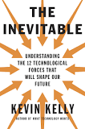

[The Inevitable - Author's Page](http://kk.org/books/the-inevitable/)

-----

<h3>The 12 technological forces that will shape our future</h3>
1. Becoming
2. Cognifying
3. Flowing
4. Screening
5. Accessing
6. Sharing
7. Filtering
8. Remixing
9. Interacting
10. Tracking
11. Questioning
12. Beginning

<h3>The 4 kinds of jobs</h3>
1. Jobs that humans can do but robots can do better.
2. Jobs that humans can't do but robots can.
3. Jobs we didn't even know we wanted done or that we couldn't imagine.
4. Jobs only humans can do (for now...).

<h3>The 7 stages of robot replacement</h3>
1. A robot can't do what I do.
2. OK, it can do it but it can't do everything I do.
3. OK, it can do everything I do, but I still need to fix it.
4. OK, but I still have to train it to do new things.
5. OK, it can have my job.
6. Wow, now that robots do my job I can focus on doing more interesting things (*my note: although some people won't know what to do and will end up permanently unemployed*).
7. I'm glad a robot can't do what I'm doing now (back to #2).

<h3>What will our job be? </h3>
Our main job is to re-discover what should humans do, and keep creating jobs for robots.

<h3>Trust</h3>
As everything can be copied or produced cheaply, and the cost of everything trends to ZERO, what is scarce and valuable? TRUST.

<h3>Drivers of value in the next 30 years</h3>
* Immediacy (I want it now)
* Personalization (something that nobody can have)
* Interpretation/Explanation (to make sense of information overload)
* Authenticity (we will value things that come direct from the creator)
* Accessibility (better than ownership)
* Embodyment (music becomes cheap, but concerts become expensive)
* Patronage (users want to pay the creators)
* Discoverability (things must be easy to find since attention spans are decreasing)

<h3>Filtering</h3>
As our options multiply, we need a way to know what is good. Some filtering mechanisms:
* Gatekeepers (trusted news organizations)
* Intermediaries
* Curators
* Brands
* Government
* Cultural environment
* Our friends
* Ourselves (the most unreliable filter)

Some new filters: algorithms and recommendation engines (the danger is that they filter based on what you already like). These filters need to improve to expose you to new things, some of which you don't know you will like.

<h3>Tracking</h3>
The 24 ways our lives are being tracked every day:
* Car movements — Every car since 2006 contains a chip that records your speed, braking, turns, mileage, accidents whenever you start your car.
* Highway traffic — Cameras on poles and sensors buried in highway record the location of cars by license plates and fast-track badges. Seventy million plates are recorded each month.
* Ride-share taxis — Uber, Lyft, and other decentralized rides record your trips.
* Long-distance travel — Your travel itinerary for air flights and trains is recorded.
* Drone surveillance — Along U.S. borders, Predator drones monitor and record outdoor activities.
* Postal mail — The exterior of every piece of paper mail you send or receive is scanned and digitized.
* Utilities — Your power and water usage patterns are kept by utilities. (Garbage is not cataloged, yet.)
* Cell phone location and call logs — Where, when, and who you call (meta-data) is stored for months. Some phone carriers routinely store the contents of calls and messages for days to years.
* Civic cameras — Cameras record your activities 24/7 in most city downtowns in the U.S.
* Commercial and private spaces — Today 68 percent of public employers, 59 percent of private employers, 98 percent of banks, 64 percent of public schools, and 16 percent of homeowners live or work under cameras.
* Smart home — Smart thermostats (like Nest) detect your presence and behavior patterns and transmit these to the cloud. Smart electrical outlets (like Belkin) monitor power consumption and usage times shared to the cloud.
* Home surveillance — Installed video cameras document your activity inside and outside the home, stored on cloud servers.
* Interactive devices — Your voice commands and messages from phones (Siri, Now, Cortana), consoles (Kinect), smart TVs, and ambient microphones (Amazon Echo) are recorded and processed on the cloud.
* Grocery loyalty cards — Supermarkets track which items you purchase and when.
* E- retailers — Retailers like Amazon track not only what you purchase, but what you look at and even think about buying.
* IRS — Tracks your financial situation all your life.
* Credit cards — Of course, every purchase is tracked. Also mined deeply with sophisticated AI for patterns that reveal your personality, ethnicity, idiosyncrasies, politics, and preferences.
* E-wallets and e-banks — Aggregators like Mint track your entire financial situation from loans, mortgages, and investments. Wallets like Square and PayPal track all purchases.
* Photo face recognition — Facebook and Google can identify (tag) you in pictures taken by others posted on the web. The location of pictures can identify your location history.
* Web activities — Web advertising cookies track your movements across the web. More than 80% of the top thousand sites employ web cookies that follow you wherever you go on the web. Through agreements with ad networks, even sites you did not visit can get information about your viewing history.
* Social media — Can identify family members, friends, and friends of friends. Can identify and track your former employers and your current work mates. And how you spend your free time.
* Search browsers — By default Google saves every question you’ve ever asked forever.
* Streaming services — What movies (Netflix), music (Spotify), video (YouTube) you consume and when, and what you rate them. This includes cable companies; your watching history is recorded.
* Book reading — Public libraries record your borrowings for about a month. Amazon records book purchases forever. Kindle monitors your reading patterns on ebooks — where you are in the book, how long you take to read each page, where you stop.

<h3>Questions</h3>
When answers are free or easy, the real value is in asking good questions.

A good question:
* Is not concerned with a correct answer.
* Cannot be answered immediately.
* Challenges existing answers.
* Is a question you want answered when you hear it, but had no idea it about it before it was asked.
* Creates a new territory of thinking.
* Reframes its own answers.
* Is a seed for innovation in science, technology, art, politics and business.
* Is a probe, a what-if scenario.
* Skirts on the edges of what is known and not known.
* Cannot be predicted.
* Is the sign of an educated mind.
* Generates many other good questions.
* Is the last job a machine will learn how to do.
* Is what humans are for.

